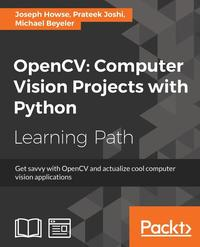

# OpenCV Python Tutorial
Hello and Welcome to my opencv python tutorial. This page is designed for the people who want to improve computer vision and image processing skills. On this tutorial, I shared some codes at the above and their descriptions as given below. 

Before getting started I want to share with you a link that indicates a book called OpenCV Computer Vision Projects with Python. 
Link for this book : https://www.pdfdrive.com/opencv-computer-vision-projects-with-python-d58213131.html

